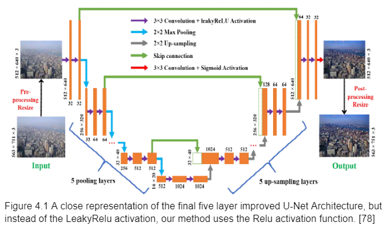
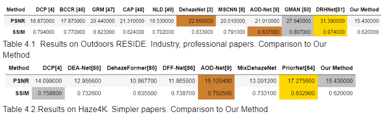
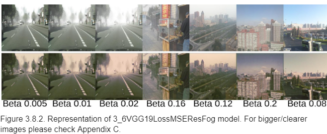

# Single Image Dehazing Software Using U-Net Architecture

## Summary:
- Dehazing, or defogging, is the process of transforming hazy/foggy images or videos by removing fine atmospheric particles like dust, smoke, and haze. Such software is crucial for enhancing visibility in applications like autonomous driving and surveillance systems, allowing for better image segmentation and object detection. These methods are categorised under computer vision techniques.

- This report outlines the necessity for image dehazing, reviews older methods, and discusses new approaches utilising neural networks, particularly encoder-decoder architectures. The developed software employs an encoder-decoder method based on the U-Net architecture. Throughout the project, the U-Net structure is enhanced with various improvements. These enhancements include additional convolutional layers, ranging from 64 to 1024 filters, as well as Batch Normalisation, Kernel Initialization, Squeeze and Excitation blocks, adding Bottleneck and Dropout layers to prevent overfitting. Throughout testing, three different activation functions are evaluated, LeakyReLU, BeReLU and ReLU, with the last one ultimately being chosen for the final model. Additionally, four loss architectures are tested, with the best performing one being a combination of perceptual loss using VGG19 architecture and a mean squared error (MSE) loss function. Output layer activation functions, such as tanh and sigmoid, are also tested, with the latter being selected for the final model.

- Efficiency evaluation of the dehazing algorithm incorporates both visual parameters and technical metrics. Peak Signal-to-Noise Ratio (PSNR) measures pixel-wise accuracy, while the Structural Similarity Index Measure (SSIM) assesses similarity to the ground truth image on a scale from 0 to 1, with 1 representing a perfect match. These parameters are assessed and compared for each enhancement incorporated into the encoder-decoder method.

- The model undergoes training on two distinct datasets: Foggy Cityscapes [32], which comprises street images, and Indoors RESIDE [34], containing images with lighter fog and more defined objects. Each dataset includes clear images, corresponding ground truth images, and a series of three to ten variations of hazy images with different fog intensities. By pairing each clear image with its hazy counterpart, the model learns to transform hazy images into clear ones. The results are then compared with those obtained from other prominent software and encoder-decoder projects, showcasing the efficiency and enhancements achieved throughout the process.

## U-Net Architecture:

## Datasets:
The datasets used for this project are Foggy Citiscapes[32], Cityscapes[33] and Reside[34], all open sourced and available for academic use.

## Evaluation:

## Sample Visual Results:

## Outline of Repository:

- **chapter3_results_code_improvements** - Contains all training files for each step described and explained in Chapter 3 of the report.
- **src** - This directory houses all source code related to model development, testing, and evaluation.
  - **results_processing** - Contains scripts and notebooks used to generate various graphs for model evaluation.
  - **final_train** - Contains the final training scripts, including the U-Net architecture and image pre-processing routines.
  - **results_main_1** - Contains testing scripts for image dehazing that require a hazy image and a corresponding clear ground truth image.
  - **results_main_2** - Contains testing scripts for image dehazing that process a hazy image and output a dehazed image without comparing it to a ground truth.

## Download data:

- Download dataset used for training -> https://drive.google.com/drive/folders/1j0-p3CdvvGVc2r4IpdjImFdElYiVKTEz?usp=sharing
- Download the final model weight -> https://drive.google.com/file/d/1OxqUwufh4D0LtvBgIXCbi5zj_G-M-udB/view?usp=sharing
